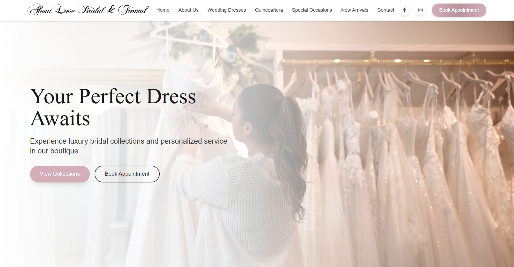

# About Love Bridal & Formal



A sophisticated website for a premium bridal boutique, featuring responsive design, seamless animations, and an elegant user interface that showcases wedding dresses, bridesmaids collections, quinceañera gowns, and special occasion wear.

## 🔗 Live Demo
[View live demo](https://aboutlovebridal.netlify.app/) 

## ✨ Project Showcase
This professionally crafted React application delivers a comprehensive online presence for About Love Bridal & Formal with:

* **Elegant UI/UX Design**: Tasteful typography, color palette, and layout that reflects the premium bridal shopping experience
* **Responsive Design**: Flawlessly adapts to mobile, tablet, and desktop devices
* **Performance Optimized**: Lazy-loaded components and optimized assets for rapid page loading
* **Interactive Elements**: Smooth animations and transitions powered by Framer Motion
* **Business Integration**: Appointment booking system connected with Square's scheduling API

## 🛠️ Technologies Used
* **React**: Frontend library for building the user interface
* **React Router**: Navigation and routing
* **TailwindCSS**: Utility-first CSS framework
* **Framer Motion**: Animation library
* **React Icons**: Icon library
* **State Management**: React Context API and useState/useEffect hooks
* **EmailJS**: Client-side email service
* **React Helmet**: Document head manager for SEO

## 📁 Project Structure
```
src/
├── App.jsx                # Main app component with routing
├── index.css              # Global styles and Tailwind imports
├── main.jsx               # Entry point
├── pages/                 # Page components
│   ├── Home.jsx           # Homepage
│   ├── AboutUs.jsx        # About page
│   ├── Dresses.jsx        # Wedding dress collections
│   ├── Bridesmaids.jsx    # Bridesmaid collections
│   ├── Quinceanera.jsx    # Quinceañera collections
│   ├── SpecialOccasions.jsx # Special occasion dresses
│   ├── Contact.jsx        # Contact page
│   ├── Detail.jsx         # Product detail page
│   └── NewArrivals.jsx    # New arrivals page
├── components/            # Reusable components
│   ├── Card/              # Product card component
│   ├── Footer/            # Site footer
│   ├── Header/            # Navigation header
│   ├── Hero/              # Hero section component
│   ├── NewArrivals/       # Featured new arrivals component
│   └── Sections/          # Other section components
└── data/                  # Data files
    └── allData.js         # Product data
```

## 🚀 Getting Started

### Prerequisites
* Node.js (v14.0.0 or later)
* npm or yarn

### Installation
1. Clone the repository:
```bash
git clone https://github.com/anicabarrios/All-About-Bridal.git
cd about-love-bridal
```

2. Install dependencies:
```bash
npm install
# or
yarn install
```

3. Start the development server:
```bash
npm run dev
# or
yarn dev
```
4. Build for production:
```bash
npm run build
# or with yarn
yarn build
```

## ⚙️ Key Features Implemented

* **Dynamic Product Filtering**: Category-based filtering on dress collection pages
* **Image Galleries**: Product detail pages with thumbnail navigation
* **Animated Page Transitions**: Smooth transitions between routes
* **Form Validation**: Contact form with client-side validation
* **Appointment Booking**: Integration with Square scheduling platform
* **Responsive Navigation**: Adaptable menu system for all device sizes
* **Social Media Integration**: Instagram feed and social media links

## 📄 License
This project is licensed under the MIT License - see the LICENSE file for details. All rights to the codebase and implementation belong to the developer.

## Client Information
About Love Bridal & Formal  
1749 N University Dr  
Pembroke Pines, FL 33024  
Phone: (754) 263-3480  
Email: aboutlovebaf@gmail.com

## Developer Contact
Anica Barrios  
Email: anicabarrios1@gmail.com 

---

© 2025 Anica Barrios. All rights reserved.  
*This is a portfolio project showcasing About Love Bridal & Formal.*